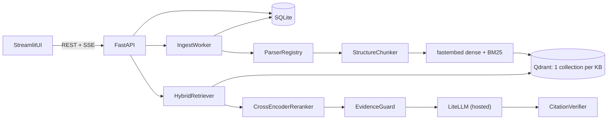

# RAG Generator - High-Level Design

Users create knowledge bases (KBs) at runtime, upload PDF/DOCX/TXT/MD files, and ask
questions. Answers are grounded in retrieved chunks, cite them as `[n]`, and every
citation is verified. When the evidence is weak the system refuses instead of guessing.

## Components

| Component | What it does |
|---|---|
| Streamlit UI | Manage KBs, upload files, watch job status, chat with expandable sources. |
| FastAPI | REST for KBs/documents/jobs, SSE for streamed answers. |
| SQLite | Stores KB, document and job metadata (never chunk text). |
| IngestWorker | Background thread that drains the job queue in SQLite; survives restarts. |
| ParserRegistry | Maps file extension to a parser via config; parsers emit blocks with page + section. |
| StructureChunker | Splits along headings, then paragraphs, within a word budget; keeps page and section. |
| Embedders | fastembed dense (`bge-small-en-v1.5`) and sparse BM25 vectors, CPU only. |
| Qdrant | One collection per KB with named dense + sparse vectors; chunk text lives in the payload. |
| HybridRetriever | Dense and sparse prefetch fused server-side with RRF. |
| CrossEncoderReranker | Re-scores the top candidates with a fastembed cross-encoder. |
| EvidenceGuard | Refuses when the reranked evidence is below the configured threshold. |
| LLM (LiteLLM) | Generates the answer from numbered sources; model is a config string. |
| CitationVerifier | Checks each `[n]` points to a real source and that the source supports the sentence. |

## Ingestion flow

1. `POST /kbs/{kb}/documents` saves the file and creates a document and a job (`queued`).
2. The worker claims the job (`running`) and picks a parser by file extension.
3. The parser returns blocks tagged with page and section.
4. The chunker groups blocks by section and splits them within the word budget, with overlap.
5. Dense and BM25 sparse vectors are computed over "document > section + text" and upserted into the KB collection.
6. The job ends `done` (with a chunk count) or `failed` (with an error); the document status follows.

## Query flow

1. `POST /kbs/{kb}/query` (JSON) or `/query/stream` (SSE) with a question.
2. Hybrid search: dense top-k plus sparse top-k, fused with RRF in one Qdrant call.
3. The cross-encoder reranks the fused candidates and keeps the top N.
4. The guard refuses if the best score or the number of supporting chunks is too low.
5. The LLM answers from numbered sources, citing `[n]`; tokens stream as SSE `token` events.
6. The verifier checks every citation; a final `citations` event returns sources with their status.

## Stack choices

| Choice | Reason |
|---|---|
| FastAPI | Async, typed request models, native streaming for SSE. |
| Qdrant | Dense + sparse vectors and RRF fusion in a single query; payload keeps chunk text. |
| fastembed | ONNX on CPU for embeddings, BM25 and cross-encoder; no torch. |
| LiteLLM | One call signature for any provider; the model is a config value. |
| SQLite | Small metadata, zero ops, transactional job queue. |
| Streamlit | Fastest route to a usable UI in pure Python. |
| Docker Compose | One command to run Qdrant, API and UI. |
| No LangChain | Each step is a small class behind a Protocol, easy to read and test. |
